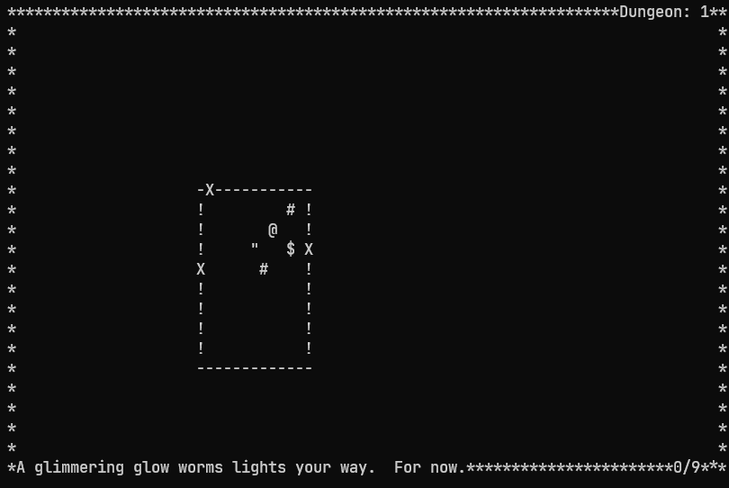

## In The Dark

A rogue-like survival game for CP/M, DOS and modern systems.




## Download

Downloads for the following systems are available in [Releases](https://github.com/kianryan/InTheDark/releases):
* ITDARK80.COM - CP/M with ANSI Terminal (developed for RC2014).
* ITDARK7.EXE - 16 Bit DOS (tested in DOS Box).
* ITDARKFP.EXE - Modern Windows executable.

## Playing

"In the Dark" in a never-ending, generative dungeon crawler, filled with light 
sources `#`, treasure `$` and Grue `"`.  Progress from dungeon to dungeon by 
exploring each room and collecting treasure.  The Grue will hide from the 
light, but when the lights go out, they're coming for you...

## Controls

**wasd** : Movement  
**q** : Quit

## Compiling

In The Dark is built on multiple generations of Turbo Pascal and Free Pascal. 
Each binary is compiled on its respective system.

### **ITDARK80.COM** - Turbo Pascal 3.0 for CP/M.  Built on a RC2014 Pro.  

* Copy source to RC2014 using [Grant Searle's z80sbcFiles FilePackager](http://searle.x10host.com/z80/SimpleZ80_32K.html) and download.com
* Copy [Turbo Pascal 3](http://www.retroarchive.org/cpm/lang/lang.htm) to RC2014.
* Start Turbo Pascal 3.
* Set drive, main file to ITDARK80.PAS.
* Set compiler options to COM.
* Build.

**ITDARK7.COM** - Turbo Pascal 5.5 for DOS.  Built using DOSBOX.  

* Download [Turbo Pascal 5.5](https://turbopascal.org/turbo-pascal-download), install under [DOSBOX](https://www.dosbox.com/) to `c:\tp`.
* Copy source files to `c:\itd`.
* Compile using TP5.5 command line compiler: 

```
c:\tp\tpc itdark7.pas /b
```

**ITDARKFP.EXE** - [Free Pascal Compiler](https://www.freepascal.org/).  Built on Windows 10.

Development builds were performed using Free Pascal, Windows Subsytem for Linux and 
Ubuntu 20.04.  You can build a Linux release with:

```
apt install lazarus
fpc itdarktp.pas
```

The same process can be used with Lazarus for windows.

## License

Copyright 2022 Kian Ryan

Permission is hereby granted, free of charge, to any person obtaining a copy of this software and associated documentation files (the "Software"), to deal in the Software without restriction, including without limitation the rights to use, copy, modify, merge, publish, distribute, sublicense, and/or sell copies of the Software, and to permit persons to whom the Software is furnished to do so, subject to the following conditions:

The above copyright notice and this permission notice shall be included in all copies or substantial portions of the Software.

THE SOFTWARE IS PROVIDED "AS IS", WITHOUT WARRANTY OF ANY KIND, EXPRESS OR IMPLIED, INCLUDING BUT NOT LIMITED TO THE WARRANTIES OF MERCHANTABILITY, FITNESS FOR A PARTICULAR PURPOSE AND NONINFRINGEMENT. IN NO EVENT SHALL THE AUTHORS OR COPYRIGHT HOLDERS BE LIABLE FOR ANY CLAIM, DAMAGES OR OTHER LIABILITY, WHETHER IN AN ACTION OF CONTRACT, TORT OR OTHERWISE, ARISING FROM, OUT OF OR IN CONNECTION WITH THE SOFTWARE OR THE USE OR OTHER DEALINGS IN THE SOFTWARE.